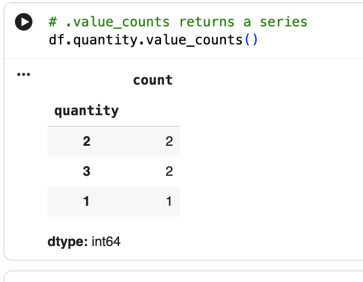
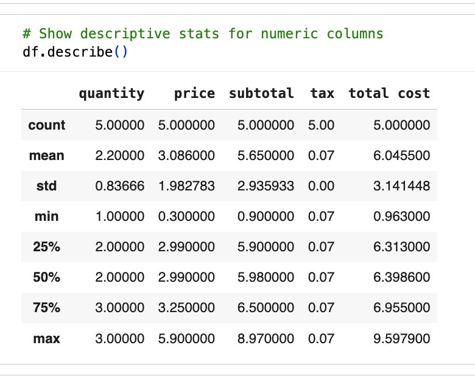
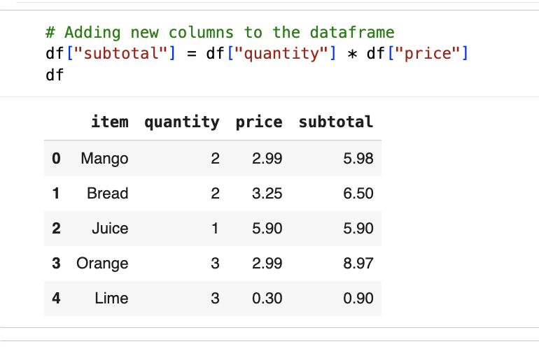
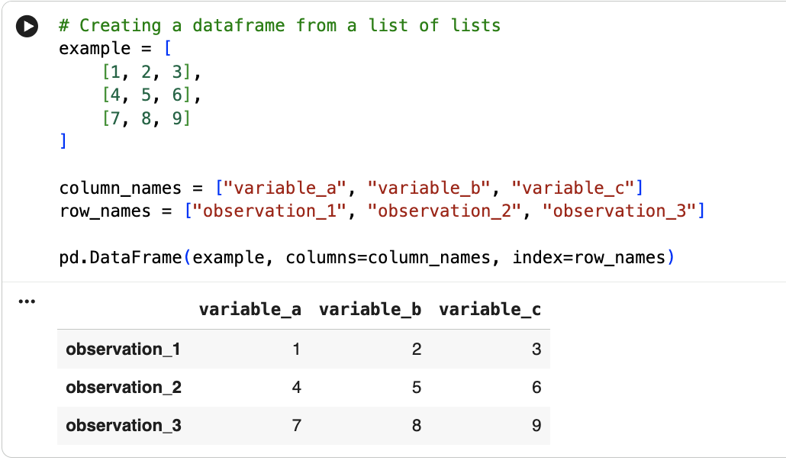

# 🐼 Python Pandas Practice

## 📘 Overview
This repository contains my exercises and practice work using **pandas**, one of the most powerful data manipulation libraries in Python.  
Through these activities, I learned how to create, explore, and modify DataFrames, as well as how to extract meaningful insights from tabular data.

---

## 🎯 Skills I Developed

### 🧱 Creating DataFrames  
✔️ I learned how to build **pandas DataFrames** from various Python collections, such as lists, dictionaries, and lists of dictionaries.

### 🔍 Exploring DataFrame Properties  
✔️ I practiced using tools like `.info()`, `.shape`, `.columns`, and `.dtypes` to understand the structure and metadata of a DataFrame.

### 🎯 Selecting Columns  
✔️ I can now select a **single column** from a DataFrame using bracket notation or dot notation.

### ➕ Adding New Columns  
✔️ I learned how to **add new columns** to a DataFrame using computed values, constants, or operations on existing columns.

### 🏷️ Renaming Columns  
✔️ I used the `.rename()` method to **rename columns** clearly and consistently.

### 📊 Descriptive Statistics  
✔️ I explored basic descriptive statistics on DataFrame columns using functions like:  
- `.describe()`  
- `.mean()`  
- `.sum()`  
- `.min()` / `.max()`  
- `.value_counts()`  

---

---
The repository also includes:  
📁 A folder containing **screenshots** of my work  
📄 A **copy of the original Google Colab file** used during the exercises  

---
Thanks for visiting this project! 🚀  

